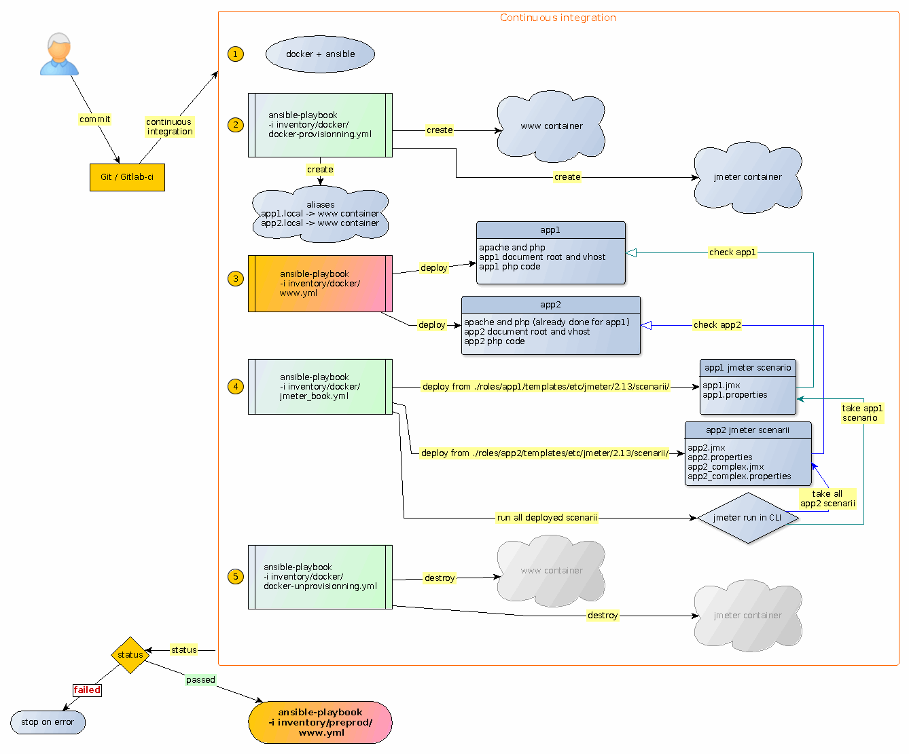

Brief
=====

"Vous avez des playbooks Ansible ?

Faisons un pas de plus vers de l'intégration continue / déploiement continu :

* docker et ansible pour provisionner des serveurs/conteneurs en fonction de l'inventory ansible.

* classique déploiement ansible des applicatifs vers les conteneurs

* tests automatiques jmeter managés par un playbook ansible

* automatisation de l'ensemble via gitlab-ci

* déploiement automatique via gilab-ci et ansible"

La Big picture :

Ce [pdf](https://github.com/arnaudblancher/ansible-meetup-paris-12-integration-continue-presentation-pdf/blob/master/ansible-meetup-paris-12-integration-continue-presentation-pdf.pdf) est celui du Meetup Ansible Paris #12 "Intégration continue / déploiement continu avec Ansible, docker jmeter et gitlab-ci".

Le "code" est là : [https://github.com/arnaudblancher/ansible-gitlab-ci-docker-jmeter](https://github.com/arnaudblancher/ansible-gitlab-ci-docker-jmeter)

License
-------

CC-BY

Authors Information
-------------------

Arnaud Blancher

[https://github.com/arnaudblancher/ansible-meetup-paris-12-integration-continue-presentation-pdf](https://github.com/arnaudblancher/ansible-meetup-paris-12-integration-continue-presentation-pdf)

Contributions
-------------

Corrections, suggestions et améliorations sont les bienvenues

